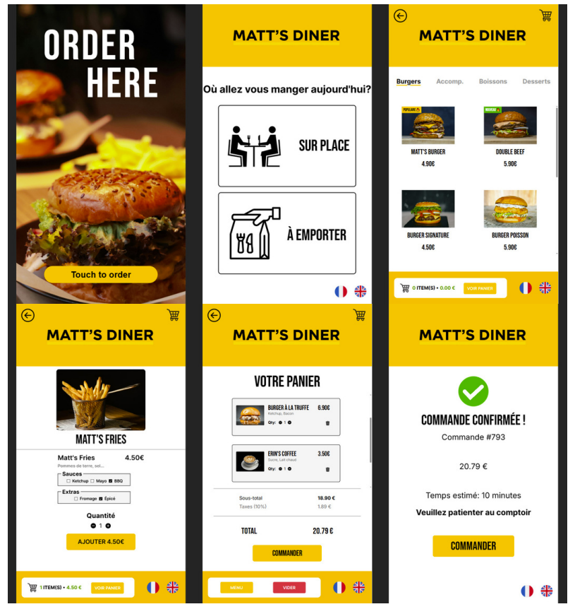

# 🍔 Matt's Diner


Application de borne de commande de restaurant développée en React pour un écran tactile kiosk (1080×1920). Consomme ma [component library](https://github.com/Kamat99302/Matt-s-Dinner-Component-Library) publiée sur npm.

---

## Le projet

Matt's Diner est une interface de borne en libre-service pour la commande en restaurant, inspirée des bornes McDonald's/KFC. L'application propose un parcours complet : choix du service, navigation du menu, personnalisation des produits, gestion du panier et confirmation de commande, le tout en français et en anglais.

⚠️ **Interface Kiosque (1080×1920)**

Ce projet simule une borne de commande de restaurant.

**Meilleur affichage : Desktop.** L'app s'adapte aux autres écrans via un scaling dynamique.

---

## Liens

- **App live :** [Netlify](https://matts-dinner.netlify.app/)
- **Code source :** [GitHub](https://github.com/Kamat99302/matts-dinner)
- **Component Library :** [npm](https://www.npmjs.com/package/matts-dinner-component-library) | [GitHub](https://github.com/Kamat99302/Matt-s-Dinner-Component-Library) | [Storybook](https://component-library-mattsdinner.netlify.app/)
- **Design Figma :** [Voir le design](https://www.figma.com/design/ceIg17J56YuNfSHVxKf4do/INTERFACE-DE-COMMANDE-KIOSK?node-id=0-1&t=J2B7rN6n1zAiqlx1-1)

---

## Stack technique

React 19 • React Router • Context API • react-i18next • Vite • CSS • npm • Netlify

---

## Fonctionnalités

- 6 pages avec routing dynamique (React Router)
- Gestion de panier complète avec Context API (ajout, suppression, calcul sous-total, taxes, total)
- Traduction FR/EN avec react-i18next (noms de produits, ingrédients, badges, options, UI)
- 29 produits répartis en 4 catégories avec personnalisation par type (sauces, extras, options)
- Numéro de commande aléatoire sur la page de confirmation
- Animation bounce sur l'icône panier et scale sur les éléments interactifs
- Scaling dynamique pour adaptation multi-écrans
- Consomme la component library via npm

---

## Architecture

L'application consomme la [matts-dinner-component-library](https://www.npmjs.com/package/matts-dinner-component-library) via npm. Le state global est géré par Context API (panier, catégorie active). Les traductions sont gérées côté app avec react-i18next — la librairie reçoit les textes traduits via props, ce qui la garde indépendante.

```
matts-dinner/
├── src/
│   ├── assets/images/       # Images produits et icônes
│   ├── components/
│   │   ├── StartScreen.jsx  # Écran d'accueil
│   │   ├── ServiceChoice.jsx # Choix sur place / à emporter
│   │   ├── Menu.jsx         # Navigation menu par catégorie
│   │   ├── ProductDetail.jsx # Détail produit avec options
│   │   ├── Cart.jsx         # Panier avec récapitulatif
│   │   └── Confirmation.jsx # Confirmation de commande
│   ├── Context/
│   │   └── CartContext.jsx  # State global (panier, catégories)
│   ├── data/
│   │   └── menuData.js     # 29 produits, 4 catégories
│   ├── i18n.js             # Configuration traductions FR/EN
│   ├── App.jsx             # Routes + scaling dynamique
│   └── main.jsx            # Point d'entrée
└── package.json
```

---

## Défis techniques résolus

**Séparation données / affichage pour la traduction**
Les catégories traduites servaient de clé de filtrage, cassant l'affichage en FR. Solution : utiliser l'index au lieu du label traduit pour filtrer les produits.

**Traduction sans coupler la librairie à i18n**
Les textes traduits sont passés en props depuis l'app. La librairie utilise des fallbacks (`{viewCartLabel || 'VIEW CART'}`) et reste indépendante.

**Options traduites dans le panier**
Les values des checkboxes sont des clés i18n. Dans le panier, chaque option est traduite dynamiquement avec `.map(opt => t(opt)).join(', ')`.

**Déploiement avec component library**
`npm link` ne fonctionne pas sur Netlify. Solution : publication de la librairie sur npm avec React en peerDependencies.

**Scaling multi-écrans**
L'app est designée pour 1080×1920. Un `useEffect` calcule le ratio de scaling et un viewport meta adapte l'affichage mobile.

---

## Démarrage

```bash
git clone https://github.com/Kamat99302/matts-dinner.git
cd matts-dinner
npm install
npm run dev
```

---

## Scripts

- `npm run dev` — Serveur de développement
- `npm run build` — Build de production
- `npm run preview` — Prévisualisation du build

---

**Matt** • [Portfolio](https://portfoliomattreact.netlify.app/) • [LinkedIn](https://www.linkedin.com/in/matthieu-juan-55568337a/)
